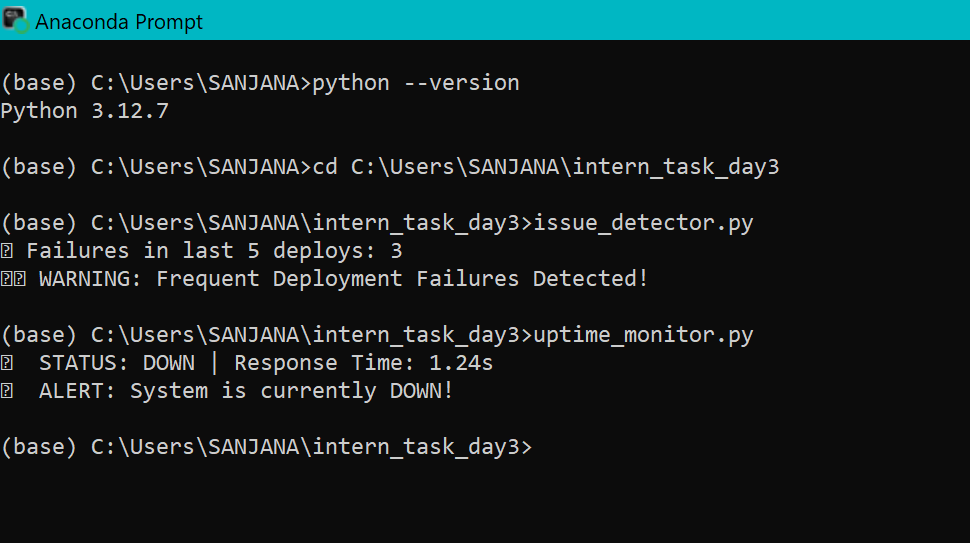

# intern-task3-deployment-monitoring

# 🚨 Task 3: Deployment Issue Detector & Uptime Monitor

This project simulates real-world DevOps monitoring tools using Python. 
It includes two key components:

- **Deployment Issue Detector** – Checks for repeated deployment failures.
- **Uptime Monitor** – Detects downtime or high response time of a system.

---

## 📁 Files Included

| File Name              | Description                            |
|------------------------|----------------------------------------|
| `deployment_log.csv`   | Simulated deployment logs              |
| `issue_detector.py`    | Script to detect frequent failures     |
| `uptime_monitor.py`    | Script to simulate uptime monitoring   |

---

## ⚙️ Features

### ✅ issue_detector.py
- Reads the last 5 deployments from log
- Detects if there are frequent failures (≥2)
- Prints alerts to terminal

### ✅ uptime_monitor.py
- Simulates uptime check
- Prints status as `UP` or `DOWN`
- Flags if response time > 1.0s

---

## 🖼️ Output Screenshots

---

## 🛠️ Tech Used

- Python 3.12
- Pandas

---

## 🔖 Topics

`python` `monitoring` `csv` `automation` `devops-simulation` `uptime` `failure-detection`

---

## 🔗 Live Use Case

This simulates how real companies monitor deployments and service uptime. 
Can be extended to real CI/CD tools like GitHub Actions, Jenkins, etc.

---
